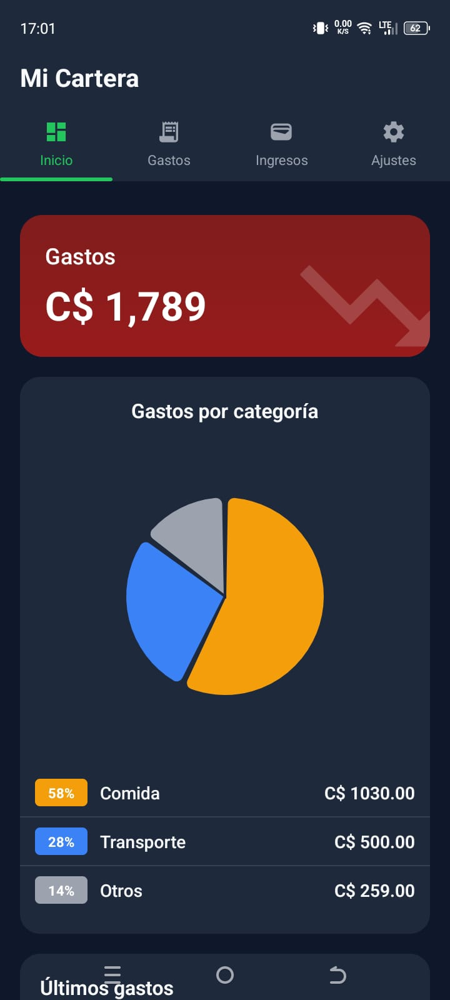
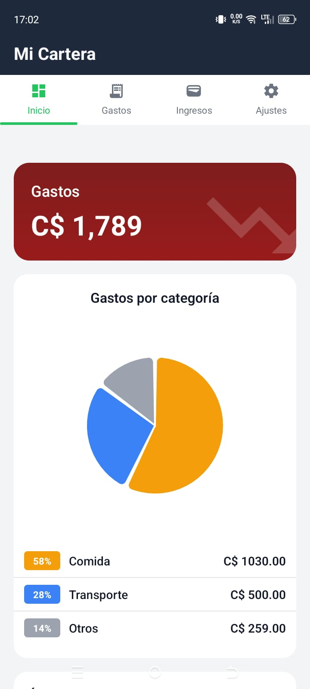
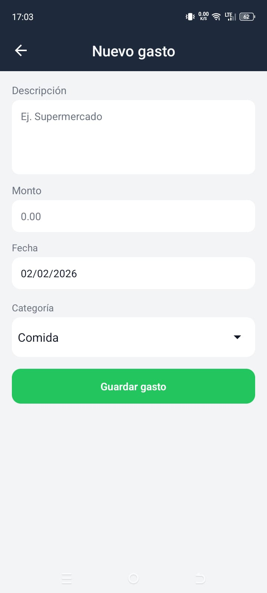
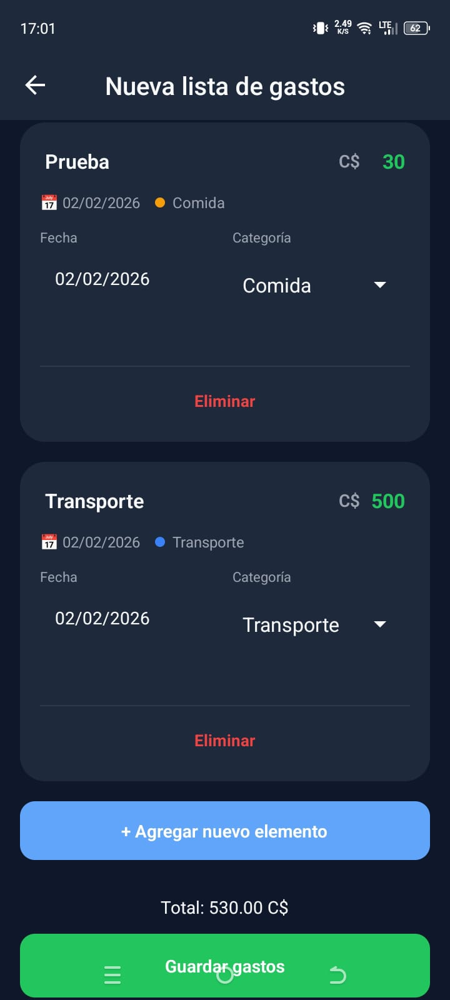
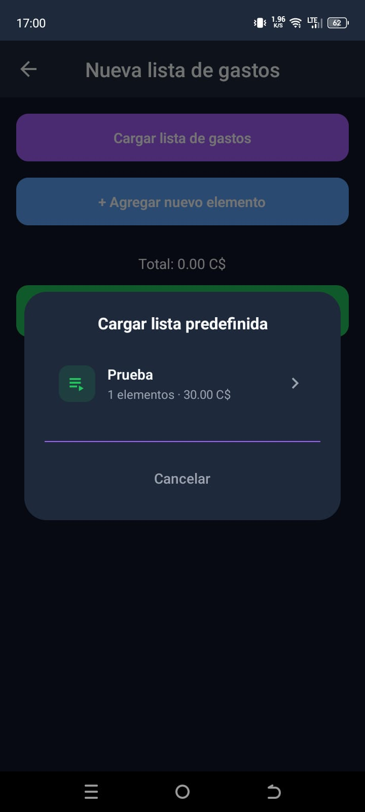
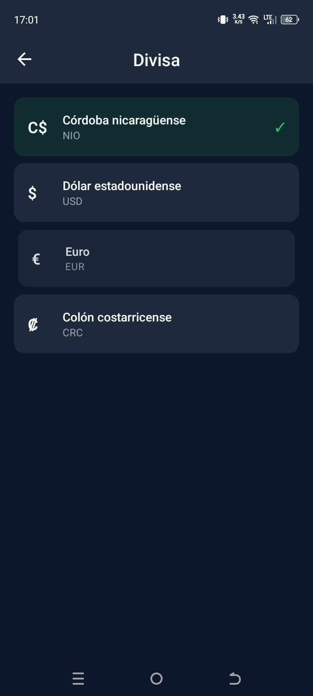
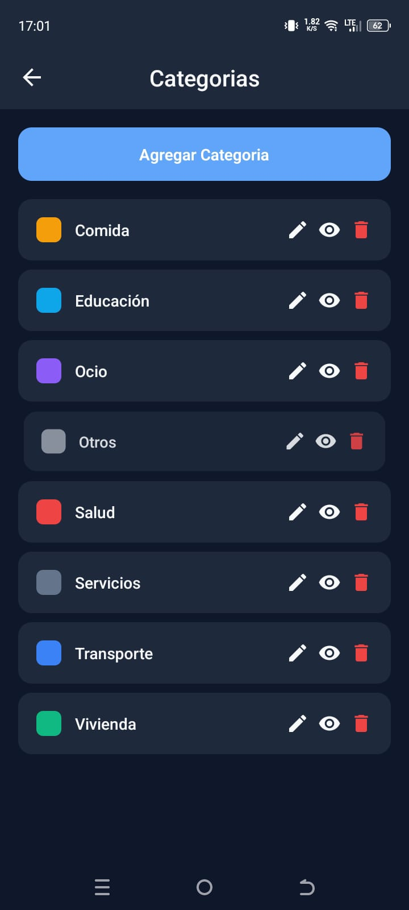
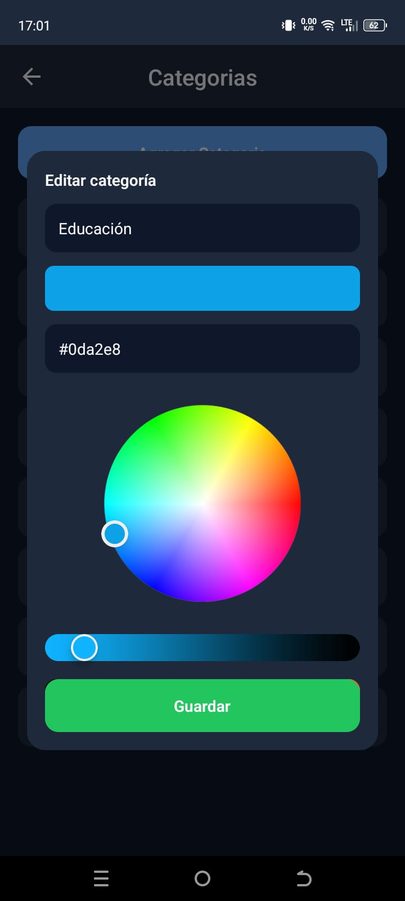

# Mi Cartera 💳

  

**Mi Cartera** es una aplicación móvil *open source* para el control personal de gastos, enfocada en simplicidad, rapidez y una experiencia visual limpia.

El proyecto está pensado como una base libre para que cualquier persona pueda **aprender, mejorar o crear su propia versión**.

---

## ✨ Características
- 📄 Registro rápido de gastos
- 🏷️ Categorías personalizadas
- 📅 Control por fechas
- 📊 Resumen mensual de gastos
- 🪙 Soporte para divisas
- 🎨 Diseño limpio y moderno
- 💾 Almacenamiento local con SQLite

---

## 📸 Capturas y guía de uso

> Las siguientes imágenes muestran el flujo principal de la app y sus funcionalidades.

### 🏠 Inicio  
Visualización del resumen mensual y gastos registrados.

  
  

---

### ➕ Nuevo gasto  
Formulario para registrar un gasto con descripción, monto, fecha y categoría.

  
  

**Cargar listas predefinidas creadas por el usuario**

  

---

### 🪙 Divisas  
Selector de divisa a mostrar en la aplicación.

  

---

### 🏷️ Categorías  
Gestión de categorías personalizadas.

  
  

---

## 📲 Descargar (Android)
👉 El archivo **APK** está disponible en la sección **Releases** del repositorio.

> ⚠️ Android puede mostrar una advertencia al instalar aplicaciones fuera de Google Play.  
> Es un comportamiento normal y seguro para este proyecto.

---

## 🛠️ Stack tecnológico
- React Native (Expo)
- TypeScript
- SQLite
- Expo Router

---